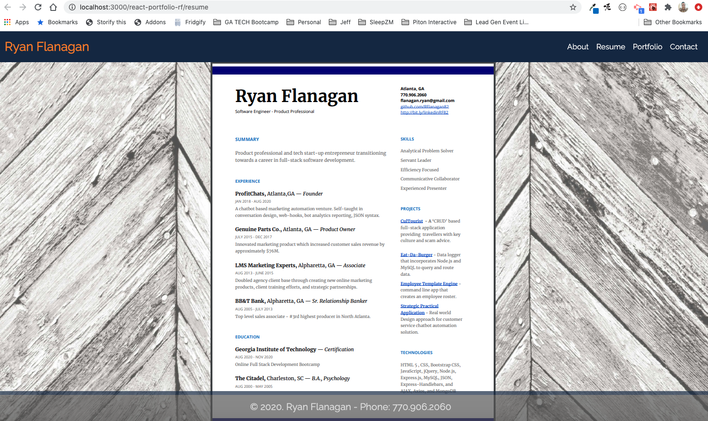
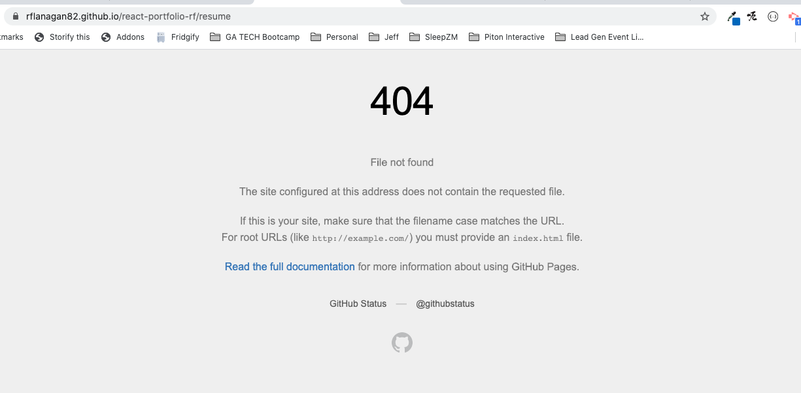

# rfportfolionew

## Description
The portfolio site contained in this repository has been created from the skills I've learned thus far within the Georgia Tech Coding Bootcamp - Fall 2020 cohort.

This site contains 4 pages to include:

- [Index Page](https://rflanagan82.github.io/react-portfolio-rf/)
- [About Page](https://rflanagan82.github.io/react-portfolio-rf/about)
- [Resume Page]()
- [Portfolio](https://rflanagan82.github.io/react-portfolio-rf/portfolio)
- [Contact]()

The site also contains a link to my latest resume as a PDF file.

## Visit My Portfolio
[Click here to access my react portfolio](https://rflanagan82.github.io/react-portfolio-rf/)

## Usage
All of the files necessary to run this website are available in [this repository](https://github.com/RFlanagan82/react-portfolio-rf).

## Badge

## Credits & Contributions
Thank you to TA - Peter Colella for helping me set up my props for the social box images on the home page and correct the links.

Thank you to TA - Leif Hetland for helping me with some CSS and formatting issues on my footer and contact page.

Thanks to my tutor for helping me with some of my path issues and fixing the architecture of my react app.

## Challenges

On the local server I can get my resume to populate in the page as shown here...

But when I get it loaded and go to the Resume page I get a 404.

.

Troubleshooted but unable to fix yet.

## Resources
* [How to Deploy React App to GitHub Pages](https://dev.to/yuribenjamin/how-to-deploy-react-app-in-github-pages-2a1f)

## License

MIT License

Copyright (c) [2020] [Ryan Flanagan]

Permission is hereby granted, free of charge, to any person obtaining a copy
of this software and associated documentation files (the "Software"), to deal
in the Software without restriction, including without limitation the rights
to use, copy, modify, merge, publish, distribute, sublicense, and/or sell
copies of the Software, and to permit persons to whom the Software is
furnished to do so, subject to the following conditions:

The above copyright notice and this permission notice shall be included in all
copies or substantial portions of the Software.

THE SOFTWARE IS PROVIDED "AS IS", WITHOUT WARRANTY OF ANY KIND, EXPRESS OR
IMPLIED, INCLUDING BUT NOT LIMITED TO THE WARRANTIES OF MERCHANTABILITY,
FITNESS FOR A PARTICULAR PURPOSE AND NONINFRINGEMENT. IN NO EVENT SHALL THE
AUTHORS OR COPYRIGHT HOLDERS BE LIABLE FOR ANY CLAIM, DAMAGES OR OTHER
LIABILITY, WHETHER IN AN ACTION OF CONTRACT, TORT OR OTHERWISE, ARISING FROM,
OUT OF OR IN CONNECTION WITH THE SOFTWARE OR THE USE OR OTHER DEALINGS IN THE
SOFTWARE.

